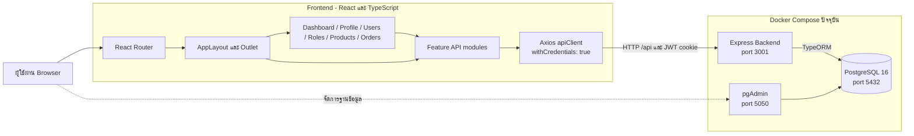
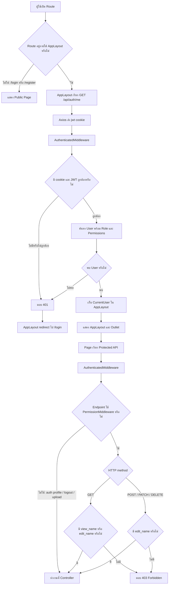
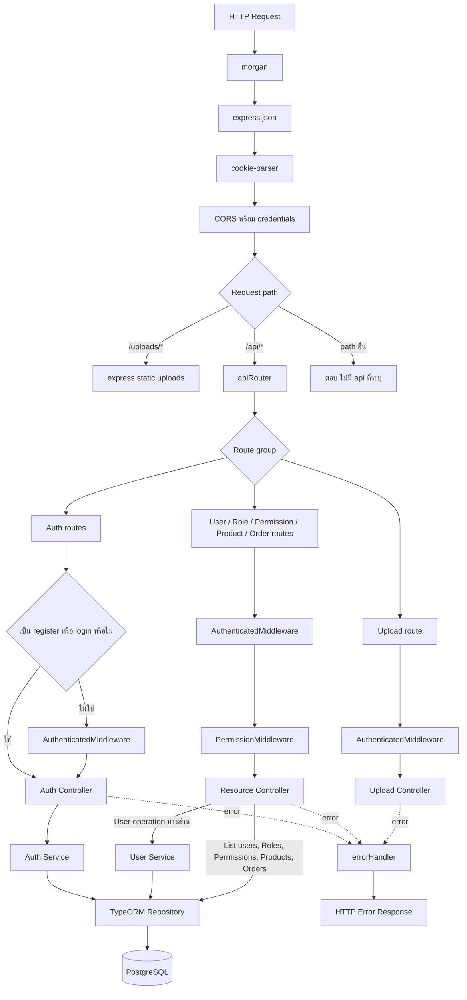
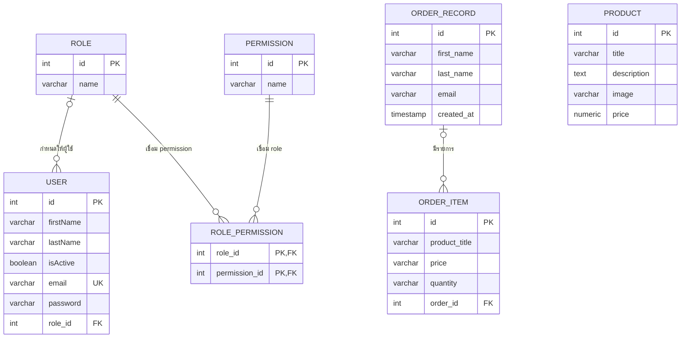

# สถาปัตยกรรมระบบ Admin Dashboard

เอกสารนี้อ้างอิงจากโค้ดปัจจุบันใน `frontend/`, `backend/`, `docker-compose.yml` และ migration `1752300000000-CreateInitialSchema.ts` โดยแสดงเฉพาะส่วนประกอบและความสัมพันธ์ที่พบในโปรเจกต์

## 1. ภาพรวมระบบ

Frontend เป็น Create React App ที่เรียก Backend ผ่าน Axios โดยค่าเริ่มต้นใช้ `http://localhost:3001/api` และส่ง cookie ด้วย `withCredentials: true` ส่วน `docker-compose.yml` ปัจจุบันประกอบด้วย Backend, PostgreSQL และ pgAdmin แต่ยังไม่มี Frontend service



องค์ประกอบสำคัญ:

- Public routes คือ `/login` และ `/register`
- Routes ภายใต้ `AppLayout` คือ Dashboard, Profile, Users, Roles, Products และ Orders
- Backend เปิด API ภายใต้ `/api` และเปิดไฟล์อัปโหลดภายใต้ `/uploads`
- Feature API ของ frontend ติดต่อ `/auth`, `/user`, `/roles`, `/permissions`, `/products` และ `/orders`
- มี `frontend/Dockerfile` แต่ยังไม่ได้เพิ่ม Frontend เป็น service ใน `docker-compose.yml`

## 2. Authentication และ Permission

Frontend ปัจจุบันใช้ state ภายใน `AppLayout` เก็บ `CurrentUser` และยังไม่ได้ใช้ Redux เป็นแหล่งข้อมูล authentication หลัก เมื่อเปิด protected page ตัว `AppLayout` จะเรียก `GET /api/auth/me`; หาก request ล้มเหลวจะนำผู้ใช้ไป `/login`



ขอบเขต Permission ที่พบใน Backend:

| API group | PermissionMiddleware |
| --- | --- |
| `/api/user` | `users` |
| `/api/roles` | `roles` |
| `/api/permissions` | `permissions` |
| `/api/products` | `products` |
| `/api/orders` | `orders` |
| `/api/auth/me`, profile, password และ logout | ตรวจ authentication แต่ไม่ใช้ PermissionMiddleware |
| `/api/uploads` | ตรวจ authentication แต่ไม่ใช้ PermissionMiddleware |

สำหรับชื่อ permission นั้น GET ยอมรับ `view_<name>` หรือ `edit_<name>` ส่วน method อื่นต้องมี `edit_<name>` เช่น `view_users` และ `edit_users`

## 3. Backend Request Flow

Request ทุกตัวผ่าน middleware ระดับแอปก่อนเข้าสู่ `/api` router ส่วน controller บางกลุ่มเรียก service และบางกลุ่มเรียก TypeORM repository โดยตรงตามโค้ดปัจจุบัน



เส้นทางหลักที่ประกาศใน `apiRouter`:

```text
/api/auth
/api/user
/api/roles
/api/permissions
/api/products
/api/orders
/api/uploads
```

## 4. Database ER Diagram

แผนภาพนี้อ้างอิงจาก TypeORM entities และ initial migration โดยตรง



ข้อสังเกตจาก schema ปัจจุบัน:

- ตารางจริงของ `ORDER_RECORD` ใช้ชื่อ `order`; ในแผนภาพเปลี่ยนชื่อ node เพื่อให้อ่านง่ายและหลีกเลี่ยงคำสงวน
- `user.role_id` เป็น nullable ใน initial migration ผู้ใช้จึงอาจยังไม่มี Role
- Role และ Permission เชื่อมแบบ many-to-many ผ่านตาราง `role_permission`
- Order และ OrderItem เชื่อมแบบ one-to-many โดย `order_item.order_id`
- Product ยังไม่มี foreign key เชื่อมกับ OrderItem; OrderItem เก็บ `product_title`, `price` และ `quantity` ของตัวเอง
- `order_item.price` และ `order_item.quantity` ถูกกำหนดเป็น `varchar` ใน entity และ migration ปัจจุบัน

## ไฟล์ต้นทางที่ใช้ตรวจสอบ

- `frontend/src/App.tsx`
- `frontend/src/shared/layout/AppLayout.tsx`
- `frontend/src/shared/api/client.ts`
- `frontend/src/features/*/api.ts`
- `backend/src/index.ts`
- `backend/src/routes/*.ts`
- `backend/src/middleware/*.ts`
- `backend/src/controller/*.ts`
- `backend/src/services/*.ts`
- `backend/src/entities/*.ts`
- `backend/src/migrations/1752300000000-CreateInitialSchema.ts`
- `backend/src/configs/data-source.ts`
- `docker-compose.yml`
